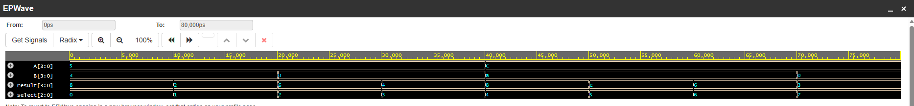

# 4-Bit ALU using Verilog HDL


## Overview

This project implements a simple 4-bit Arithmetic Logic Unit (ALU) using Verilog HDL.

The ALU performs basic arithmetic and logical operations based on a 3-bit select input. The design is simulated using a Verilog testbench, and the results are verified using the EPWave waveform viewer.

## Features

- 4-bit input operands
- 8 arithmetic and logical operations
- Combinational ALU design
- Verilog HDL implementation
- Verilog testbench for simulation
- Waveform verification using EPWave

## Operations

| Select | Operation | Description |
|--------|-----------|-------------|
| 000 | Addition | A + B |
| 001 | Subtraction | A - B |
| 010 | Increment | A + 1 |
| 011 | Decrement | A - 1 |
| 100 | AND | A & B |
| 101 | OR | A \| B |
| 110 | XOR | A ^ B |
| 111 | NOT | ~A |

## Block Diagram

```text
                 4-BIT ALU
                     |
          +----------+----------+
          |                     |
   Arithmetic Unit          Logic Unit
          |                     |
   +------+------+        +-----+-----+
   |      |      |        |     |     |
  ADD    SUB    INC      AND    OR   XOR
                       + NOT
          |
          +----------+
                     |
                4-bit Result
```

## Project Structure

```text
4-bit-ALU-Verilog/
│
├── alu_4bit.v
├── alu_4bit_tb.v
├── alu_waveform.png
├── README.md
└── LICENSE
```

## Tools Used

- Verilog HDL
- EDA Playground
- EPWave

## Simulation

The 4-bit ALU was simulated using a Verilog testbench in EDA Playground.

The testbench applies different input combinations and select signals to verify all eight ALU operations. The input signals and output result were observed using the EPWave waveform viewer.

### EPWave Simulation Waveform



## Simulation Result

All eight arithmetic and logical operations were successfully simulated and verified through waveform analysis.

The waveform shows the changes in:

- `A[3:0]`
- `B[3:0]`
- `select[2:0]`
- `result[3:0]`

for each ALU operation.

## Applications

- Digital system design
- Arithmetic logic units
- Processor arithmetic operations
- Embedded systems
- VLSI design fundamentals
- Verilog HDL learning

## Learning Outcomes

Through this project, the following concepts were practiced:

- Verilog HDL syntax
- Combinational circuit design
- Arithmetic operations in Verilog
- Bitwise logic operations
- `case` statements
- Verilog testbench development
- Digital waveform analysis

## Author

**Vinay B**

---

⭐ If you find this project useful, feel free to explore the repository.
